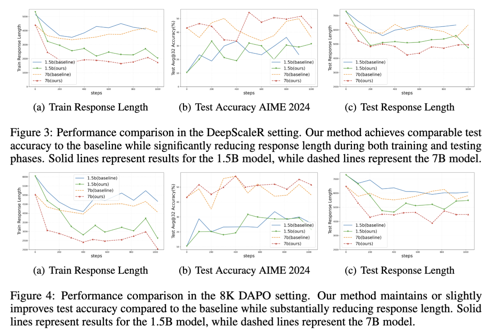
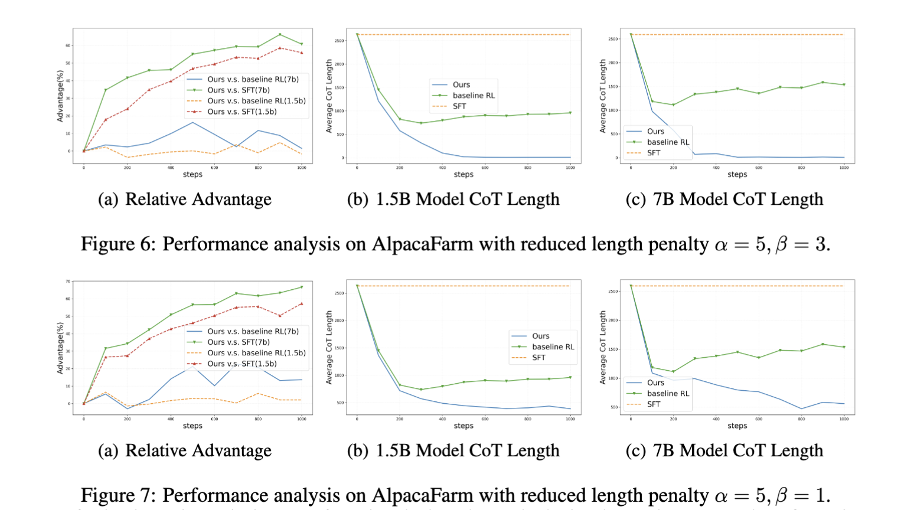

# Think When You Need: Self-Adaptive Chain-of-Thought Learning


[](https://arxiv.org/abs/2504.03234)
[](LICENSE)

> This code is based on [VeRL](https://github.com/volcengine/verl) framework 

## Key Insights ✨  
- **🧠 Adaptive Reasoning Control** – Dynamically adjusts reasoning depth based on question complexity for optimal efficiency.  
- **⚖️ Dual Reward Optimization** – Balances answer quality and brevity through comparative evaluation.  
- **📊 Versatile Task Support** – Handles both verifiable (fact-based) and fuzzy (open-ended) reasoning tasks.  
- **🔍 Scaling Laws Revealed** – Larger models achieve better results with *shorter* reasoning chains (*"Less is more"* for biger models).  

## Verify Task




**Experimental Setup**: 1.5B model with 8K max sequence length

| Benchmark | Response Length (tokens) |  | Accuracy (%) |  |
|------------|-----------|-------------|----------|-------|
|  | **Baseline** | **Ours (Δ%)** | **Baseline** | **Ours** |
| **AIME 2024** | 6,031 | 4,653 🔻22.9 | 28.0 | 28.0 |
| **AMC** | 4,594 | 3,358 🔻26.9 | 65.0 | 63.0 |
| **MATH 500** | 2,567 | 1,480 🔻42.4 | 82.5 | 85.0🟢 |
| **Minerva** | 3,136 | 1,581 🔻49.6 | 26.4 | 27.4🟢 |
| **Olympiad Bench** | 4,360 | 3,323 🔻23.8 | 45.3 | 45.6🟢 |
| **Average** | 4,137 | 2,879 🔻30.4 | 49.4 | 49.8🟢 |


## Fuzzy Task


## Quick Start
### Installation
```bash
cd TWYN
pip install -e .
```

### Datasets

Our raw Training data is from [DeepScaleR](https://huggingface.co/datasets/agentica-org/DeepScaleR-Preview-Dataset)
and [DAPO](https://huggingface.co/datasets/BytedTsinghua-SIA/DAPO-Math-17k).

Validation Data: AIME 2024,AMC 2023,MATH 500,Minerva Math,Olympiad Bench.

*Data Template*
All data was parsed using the following template: `{question} Let's think step by step,write the thought in <think> and </think>,then output the final answer within \\boxed{}.`

*Data Sample*

```python
[{"content": "In triangle $ABC$, $\\sin \\angle A = \\frac{4}{5}$ and $\\angle A < 90^\\circ$. Let $D$ be a point outside triangle $ABC$ such that $\\angle BAD = \\angle DAC$ and $\\angle BDC = 90^\\circ$. Suppose that $AD = 1$ and that $\\frac{BD}{CD} = \\frac{3}{2}$. If $AB + AC$ can be expressed in the form $\\frac{a\\sqrt{b}}{c}$ where $a, b, c$ are pairwise relatively prime integers, find $a + b + c$. Let's think step by step,write the thought in <think> and </think>,then output the final answer within \\boxed{}.",
"role": "user"}]
```


### Training Scripts
#### verifiable task
```bash
bash scripts/math/twyn_1.5b_16k_train_dapo_grpo.sh
```
#### fuzzy task
```bash
bash scripts/alpaca/twyn_7b_train_alpaca_grpo_gpu32.sh
```

## Citation
If you use this work in your research, please cite:
```bibtex

```

## License
This project incorporates code from:
- [VERL] (licensed under Apache-2.0)
- [DAPO] (licensed under Apache-2.0)
- [DeepScaleR](licensed under MIT)

The combined work is licensed under [Apache-2.0].

